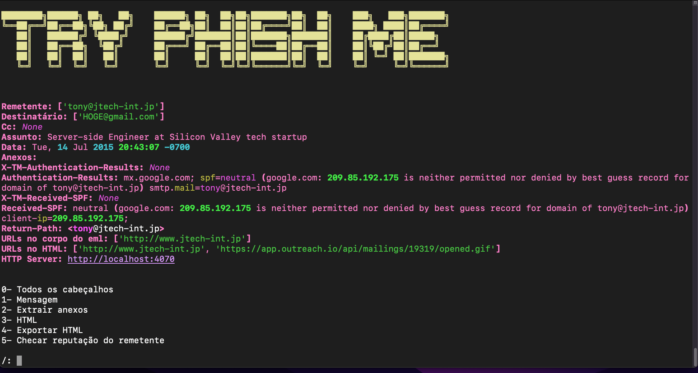

# Python EML Ripper

*Esta ferramenta está em desenvolvimento.

## Utilidades:

 - Análise de cabeçalhos
 - Extração de anexos
 - Extração de URLs
 - Análise de HTML
 - Checagem de reputação de IP

 ## A fazer:

- Integração com cuckoo sandbox - Self-Hosted
- Integração com API pública VirusTotal
- Bruteforce automático de arquivos pdf e zip
- Refatorar código
